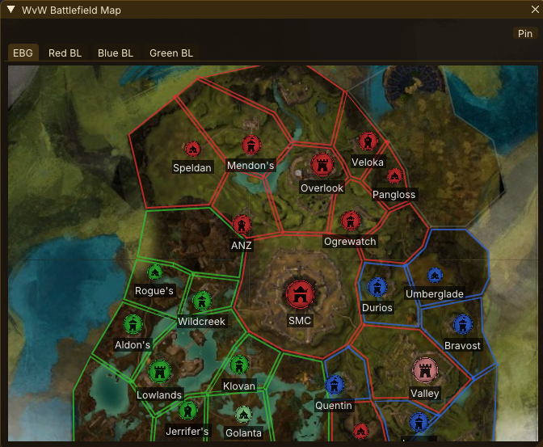
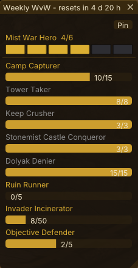

# Realm Report

A Guild Wars 2 addon for [Raidcore Nexus](https://raidcore.gg/Nexus) that provides a live WvW (World vs World) objective tracker and battlefield map overlay. See the state of every camp, tower, keep, and castle across all four WvW maps at a glance — right inside the game.

## Memory Reading Notice

Realm Report reads Guild Wars 2's memory to show live WvW objective ownership and upgrade tiers, to detect which guild has claimed each objective along with its slotted tactics and improvements, and to track your kills and deaths — faster and more reliably than the public API allows.

Realm Report only ever **reads** the game's memory — it never writes to or modifies the game, injects code, bots, or automates gameplay. See the [LICENSE](LICENSE) for details and for the read-only source access ArenaNet developers may request.

If you are not comfortable with an addon reading game memory, please **uninstall Realm Report or disable auto-updates**.

## AI Notice

This addon has been created largely using Claude. I understand that some folks have a moral, financial or political objection to creating software using an LLM. I just wanted to make a useful tool for the GW2 community, and this was the only way I could do it.

If an LLM creating software upsets you, then perhaps this repo isn't for you. Move on, and enjoy your day.

## Features

### Objective Tracker
- **Live WvW objective tracking** across all four maps — ownership, upgrade tiers, and claims read live from the game
- **World selection** — searchable list of all GW2 worlds
- **Color-coded team ownership** — Red, Blue, Green at a glance
- **Sortable, filterable table** — by map, name, type, owner, flip time, upgrade tier, claimed guild, or PPT
- **Slotted tactics & improvements** — icons for each claimed objective's WvW tactics and improvements, with tooltips
- **Scoreboard** — current match scores for all three teams
- **Upgrade tier display** — T0–T3 with exact yak tooltip
- **Guild claim display** — shows which guild has claimed each objective
- **Pinned objectives** — pin the ones you care about to the top
- **Nearest waypoint** — right-click an objective to copy its nearest waypoint chat link
- **Stale data indicators** — maps flag when data goes quiet

### WvW Battlefield Map

- **Live map overlay** — a floating window toggled with **Alt+M** or the toolbar button
- **Real GW2 map tiles** — cached to disk across sessions
- **Four map tabs** — Eternal Battlegrounds and the three Borderlands
- **Real objective icons** — the in-game ground-decal icons, tinted by owning team, with community short names (SMC, Garri, etc.)
- **Righteous Indignation indicator** — recently captured objectives blink and throb while their lord is still invulnerable
- **Auto-switch** — optionally follow the map tab to whichever map you're standing on
- **Player position** — your location on the correct map tab
- **Pan and zoom**, with per-objective tooltips

### Combat Stats
- **Kills, deaths, and K/D ratio** for your current WvW session, read from the game — no ArcDPS required
- **Resets** on entering WvW or on demand

### Weekly Tracker

- **WvW weekly achievement progress** — tracks your contribution toward the Mist War Hero weekly meta

### Flip Notifications
- **Toast notifications** when any objective changes hands, tagged with the map
- **Configurable sound** — play a WAV or MP3 on each flip
- **Configurable position and duration**
- **Auto-paused** when you leave WvW

### General
- **TrueType fonts** — a bundled clean font, or drop your own `.ttf`, with per-window size control
- **Per-window pin & opacity** — pin any window as a borderless, translucent overlay; settings persist between sessions
- **Pie UI theme** — optionally matches the colour theme of the [Pie UI](https://github.com/PieOrCake/pie_ui) addon when installed
- **GW2 theme** — dark interface with gold accents by default
- **Persistent settings** saved between sessions
- **Quick access icon** in the Nexus toolbar to show or hide the windows

## Installation

1. Install [Raidcore Nexus](https://raidcore.gg/Nexus) if you haven't already.
2. Download **`RealmReport.dll`** from the [latest release](https://github.com/PieOrCake/realm_report/releases/latest).
3. Copy it into `Guild Wars 2/addons/`.
4. Launch the game — the addon appears in the Nexus library.

## Usage

- Press **ALT+SHIFT+W** to toggle the objective tracker (or click the Realm Report icon in the Nexus Quick Access bar).
- Press **Alt+M** to toggle the battlefield map.
- Select your world from the dropdown.
- Right-click any objective to pin it or copy its nearest waypoint.

## License

Realm Report is closed source. See [LICENSE](LICENSE). You may download and use the addon free of charge, including for streaming and content creation. The source code is not public — see the license for why, and for the access ArenaNet developers may request.

## Third-Party Notices

The compiled addon uses the following open-source libraries:

- [Dear ImGui](https://github.com/ocornut/imgui) — MIT License, Copyright (c) 2014-2021 Omar Cornut
- [nlohmann/json](https://github.com/nlohmann/json) — MIT License, Copyright (c) 2013-2025 Niels Lohmann
- [Nexus API](https://raidcore.gg/Nexus) — MIT License, Copyright (c) Raidcore.GG

---

Realm Report is an unofficial, fan-made addon. Guild Wars 2 and ArenaNet are trademarks of ArenaNet, LLC and NCSOFT Corporation. Realm Report is not affiliated with, endorsed by, or sponsored by ArenaNet or NCSOFT.
