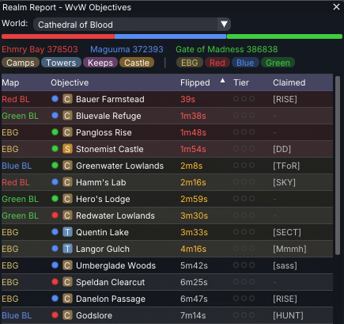

# Realm Report

A Guild Wars 2 addon for [Raidcore Nexus](https://raidcore.gg/Nexus) that provides a live WvW (World vs World) objective tracker overlay. Squad commanders can see the state of every camp, tower, keep, and castle across all four WvW maps at a glance — right inside the game.

## AI Notice

This addon has been 100% created in [Windsurf](https://windsurf.com/) using Claude. I understand that some folks have a moral, financial or political objection to creating software using an LLM. I just wanted to make a useful tool for the GW2 community, and this was the only way I could do it.

If an LLM creating software upsets you, then perhaps this repo isn't for you. Move on, and enjoy your day.

## Screenshot



## Features

- **Live WvW objective tracking** — polls the official GW2 API every 30 seconds (configurable)
- **World selection dropdown** — searchable/filterable list of all GW2 worlds
- **Color-coded team ownership** — Red, Blue, Green at a glance
- **Sortable table** — sort by map, objective name, type, owner, flip time, upgrade tier, claimed guild, or PPT
- **Map & type filters** — toggle EBG/borderlands and camps/towers/keeps/castle visibility
- **Scoreboard** — current match scores for all three teams
- **Upgrade tier display** — derived from yaks delivered (T0–T3) with exact yak tooltip
- **Recently flipped highlighting** — objectives flipped in the last 5 minutes are highlighted yellow
- **Guild claim display** — shows which guild has claimed each objective
- **Persistent settings** — world selection and poll interval saved between sessions
- **No API key required** — WvW data is public on the GW2 API

## GW2 API Endpoints Used

- `/v2/worlds?ids=all` — world list for the dropdown
- `/v2/wvw/matches?world=<id>` — match data including all objectives, scores, kills
- `/v2/wvw/objectives?ids=all` — objective name/type resolution (cached)
- `/v2/guild/<id>` — guild name/tag resolution for claims (cached)

## Building

### Prerequisites

- CMake 3.20+
- MinGW cross-compiler (`x86_64-w64-mingw32-gcc`, `x86_64-w64-mingw32-g++`)

### Setup

Download dependencies (ImGui and nlohmann/json):

```
chmod +x scripts/setup.sh
./scripts/setup.sh
```

### Build

```
mkdir build && cd build
cmake ..
make
```

This produces `RealmReport.dll`.

## Installation

1. Install [Raidcore Nexus](https://raidcore.gg/Nexus) if you haven't already
2. Copy `RealmReport.dll` into `<GW2>/addons/`
3. Launch the game — the addon loads automatically

## Usage

- Press **ALT+SHIFT+W** to toggle the overlay (or click the Realm Report icon in Nexus Quick Access)
- Select your world from the dropdown
- The table auto-updates every 30 seconds
- Click column headers to sort
- Use the filter checkboxes to narrow down maps or objective types

## Project Structure

```
realm_report/
├── CMakeLists.txt              # Build configuration
├── RealmReport.def             # DLL export definition
├── include/
│   └── nexus/
│       └── Nexus.h             # Raidcore Nexus API header
├── src/
│   ├── dllmain.cpp             # Addon entry point, ImGui UI, world selector, objectives table
│   ├── WvWAPI.h                # WvW API client interface
│   └── WvWAPI.cpp              # HTTP polling, JSON parsing, world list, match data
├── scripts/
│   └── setup.sh                # Dependency download script
└── README.md
```

## License

This project is licensed under the MIT License.

## Third-Party Notices

This project uses the following open-source libraries:

- [Dear ImGui](https://github.com/ocornut/imgui) — MIT License, Copyright (c) 2014-2021 Omar Cornut
- [nlohmann/json](https://github.com/nlohmann/json) — MIT License, Copyright (c) 2013-2025 Niels Lohmann
- [Nexus API](https://raidcore.gg/Nexus) — MIT License, Copyright (c) Raidcore.GG
